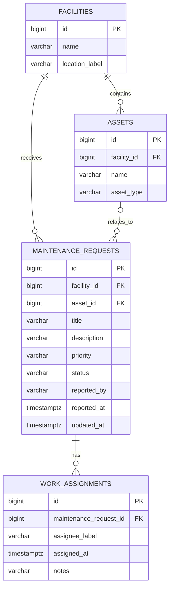

# BankFix ERD

```mermaid
erDiagram
  FACILITIES ||--o{ ASSETS : contains
  FACILITIES ||--o{ MAINTENANCE_REQUESTS : receives
  ASSETS o|--o{ MAINTENANCE_REQUESTS : relates_to
  MAINTENANCE_REQUESTS ||--o{ WORK_ASSIGNMENTS : has

  FACILITIES {
    bigint id PK
    varchar name
    varchar location_label
  }
  ASSETS {
    bigint id PK
    bigint facility_id FK
    varchar name
    varchar asset_type
  }
  MAINTENANCE_REQUESTS {
    bigint id PK
    bigint facility_id FK
    bigint asset_id FK
    varchar title
    varchar description
    varchar priority
    varchar status
    varchar reported_by
    timestamptz reported_at
    timestamptz updated_at
  }
  WORK_ASSIGNMENTS {
    bigint id PK
    bigint maintenance_request_id FK
    varchar assignee_label
    timestamptz assigned_at
    varchar notes
  }
```

Design decision: `maintenance_requests` is the main Week 1 CRUD resource. An optional asset must belong to the same facility as the request, enforced by a composite foreign key.
